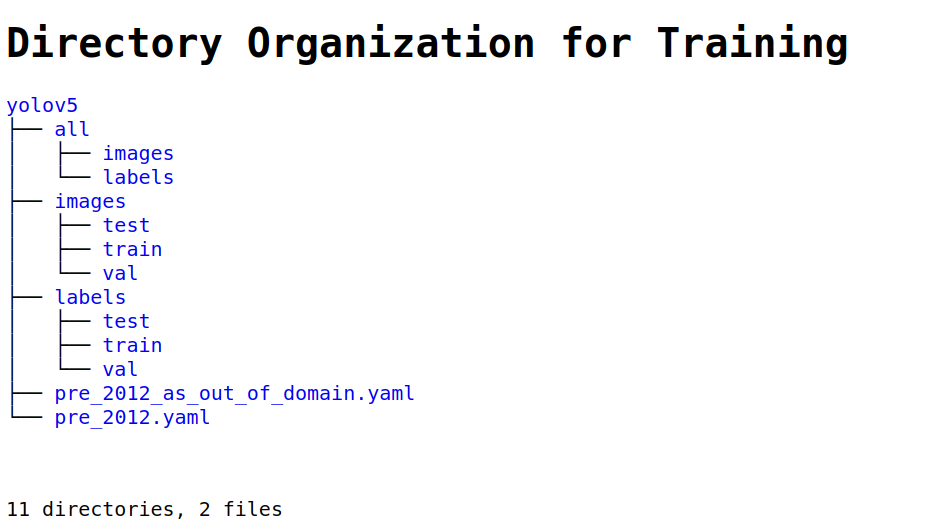

# AIO CaseStudy

## A Case Study for Object Detection of Selected Marine Species from FathomNet Data

This guide provides code and presents a guideline on how results presented in the paper:

*Demystifying image-based machine learning: a practical guide to automated analysis of imagery using modern machine learning tools*

were obtained.

The code includes bash shell and Python scripts and makes use of [`fathomnet-py`](https://github.com/fathomnet/fathomnet-py) and [`YOLOv5`](https://github.com/ultralytics/yolov5). [`Python >= 3.7`](https://www.python.org/downloads/) is required.

Scripts for creating the dataset and training the model were mainly run and tested on in-house hardware using systems running Ubuntu 18.04LTS and 20.04LTS. One system with four NVIDIA GeForce RTX 2080 GPUs, each GPU with 12 MB of memory, and 24 Intel Core i9 CPUs. The second one with one NVIDIA GPU GeForce RTX 2070 with 12 MB of memory, and 12 Intel Core i7 CPUs. For training, systems with GPUs are highly recommended. Training run on only CPUs can take a very long time. Some training was also run on [`Google Colab`](https://colab.research.google.com/), where standard GPUs are typically NVIDIA K80 and T4 Tensor Core CPUs. 


## Train on FathomNet Dataset ##

### Create Dataset ###

YOLOv5 requires labeled data to learn the object classes. The dataset for this case study is built from imagery and object labels housed in the FathomNet database. The following steps describe how to build the case study dataset from images and labels in FathomNet.

<details>
<summary>Download data</summary>

[`download_images_and_bboxes.sh`](data/scripts/download_images_and_bboxes.sh) is a bash script to download images and bounding boxes for the species selected. It requires `fathomnet.py`, which can be installed via

```bash
python -m pip install fathomnet
```

Details about fathomnet.py and its requirements can be found [here](https://github.com/fathomnet/fathomnet-py)

The classes used in the case study are:
* Chiroteuthis calyx
* Dosidicus gigas
* Gonatus onyx
* Sebastes
* Sebastes diploproa
* Sebastes melanostomus
* Sebastolobus
* Nanomia bijuga

For training and detection purposes, Sebastes, Sebastes diploproa and Sebastes melanostomus are grouped as a single Sebastes class due to the small number of images for the two latter species.
Nanomia bijuga is used only as a distractor class in a separate analysis.

[`download_images_and_bboxes.sh`](data/scripts/download_images_and_bboxes.sh)  will download the data into the different spatial/depth regions and temporal regions. Nanomia bijuga is downloaded separetely.

```bash
source download_images_and_bboxes.sh
```

The data will be downloaded to directory `data` in the directory where the script is run.
<details>
   <summary>Data Directories</summary> 
    <p>
  
   </p>
 </details>  
  
</details>

<details>
<summary>Annotations</summary>

Data annotations are downloaded in COCO format. To convert COCO json files to YOLO format, use [`coco2yolo.py`](data/scripts/coco2yolo.py).

```bash
python3 coco2yolo.py path/to/coco/json/files
```

where `path/to/coco/json/files` is a directory that is searched to find all COCO `*.json` files from which the corresponding YOLO annotations files are generated.

To convert all the COCO json files in `data`:
```bash
python3 coco2yolo.py .../user/data
```
</details>
<details>
<summary>Prepare data for training</summary>

[`prepare_data_for_training.py`](data/scripts/prepare_data_for_training.py) is a Python script that prepares the data for training. The script will split data for each species into train, val, and test directories, create an out-of-domain dataset consisting of all the images, produce the yaml files required and store everything in the appropriate domain directories.

For example:

if downloaded images and labels are found in
```
    …/user/data/pre_2012/species/<images,labels>
```
       
`prepare_data_for_training` will produce the [following](data/images/yolov5_dirs.png) in a separate yolov5 directory.

The images and labels directories for training will be created in
```
    …/user/data/pre_2012/yolov5/images/<train,val,test>
    …/user/data/pre_2012/yolov5/labels/<train,val,test>
 ```
 The out of domain dataset can be found in
 ```
       …/user/data/pre_2012/yolov5/all/<images,labels>
 ```
 and the yaml files will be:
 ```
       …/user/data/pre_2012/yolov5/pre_2012.yaml
       …/user/data/pre_2012/yolov5/pre_2012_as_out_of_domain.yaml
 ```
   <details open>
   <summary>Training Directories</summary> 
    <p>
      
    </p>
   </details>  
    
</details>

### Train ###
For this case study, we use YOLOv5. For information, requirements, installation and examples,
see  [YOLOv5](https://github.com/ultralytics/yolov5).

<details>
<summary>Train</summary>

To train a YOLOv5 model with our datasets, the command in general is
```bash
python3 train.py --img 640 --batch 16 --epochs 300 --data <data.yaml> --weights yolov5s.pt --cache
```

Training results are saved to `runs/train` with incrementing directories, i.e. `runs/train/exp2`, `runs/train/exp3`, etc.
Adding `--name <some_name>` to train.py will save training results in `runs/train/some_name`, `runs/train/some_name2`, etc.

</details>

### Evaluate Detector Performance ###
Once the model is trained, use the best.pt weights to validate accuracy on test data
<details>
<summary>Validate</summary>

To validate a YOLOv5 model with our datasets, the command would look like

```bash
python3 val.py --data {data.directory}/{domain}.yaml --weights runs/train/exp/weights/best.pt --task test
```
To validate the out-of-domain data, refer to the yaml file in the different domain the out-of-domain data.
For example, if training was done on pre_2012 data, the out-of-domain yaml file will be in the post_2012 directory.

```bash
python3 val.py --data {data.directory}/{domain}_as_out_of_domain.yaml --weights runs/train/exp/weights/best.pt --task test
```

</details>

### Inference ###
Use detect.py to run inference on test and out of domain images.

<details>
<summary>Inference</summary>

```bash
python detect.py --weights runs/train/exp/weights/best.pt --img 640 --conf 0.65 --source {dataset.location}/test/images
```

</details>

A [Google Colab Notebook](https://github.com/heinsense2/AIO_CaseStudy/blob/main/notebooks/Training_on_FathomNet_Custom_Data.ipynb) is provided as an example on how to run the train, validation and detection pipeline.
 


### Additional Steps ###

<details>
<summary>Additional Steps</summary>

- [Image Augmentation](additional/STEPS.md#image_augmentation)
- [Image Resolution](additional/STEPS.md#image_resolution)
- [Train with Background Images](additional/STEPS.md#background_images)
- [Class Coarsening](additional/STEPS.md#class_coarsening)
- [Training with Distractor Classes](additional/STEPS.md#distractor_class)

</details>

