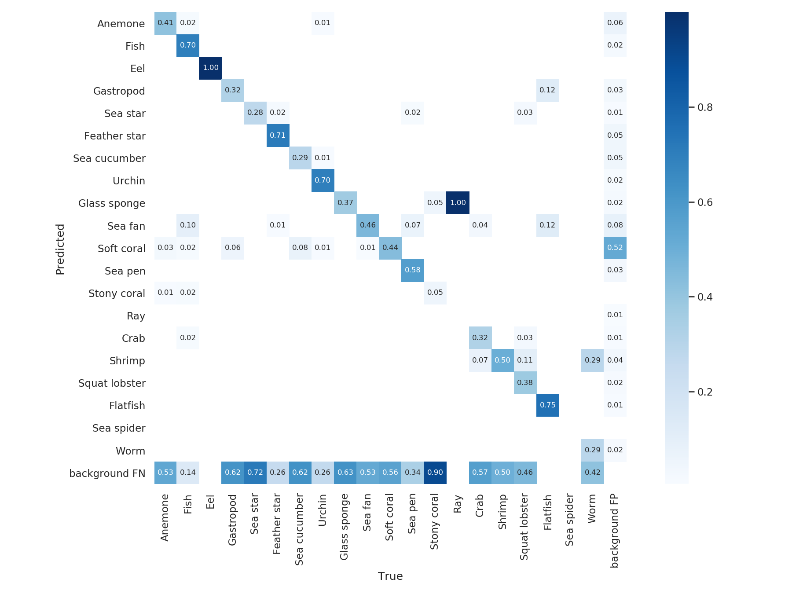
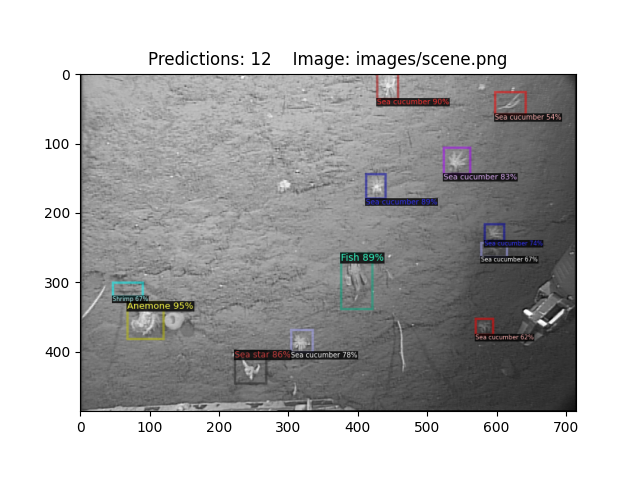

#### Description 
This is a RetinaNet model fine-tuned from the Detectron2 object detection platform's ResNet backbone to identify 20 benthic supercategories drawn from MBARI's remotely operated vehicle image data collected in Monterey Bay off the coast of Central California. The data is drawn from FathomNet and consists of 32779 images that contain a total of 80683 localizations. The model was trained on an 85/15 train/validation split at the image level. DOI: 10.5281/zenodo.5571043

**Model name:** [MBARI Monterey Bay Benthic Supercategory](https://zenodo.org/record/5571043#.YbEUQi1h1TY)</b>
**Architecture:** RetinaNet  
**Encoder:** ResNet-50  
**Codebase:** Detectron2  

  

#### Example output

Below is an example of what this model outputs; this and the [others](predictions/) were randomly sampled from FathomNet.

 
  
  

