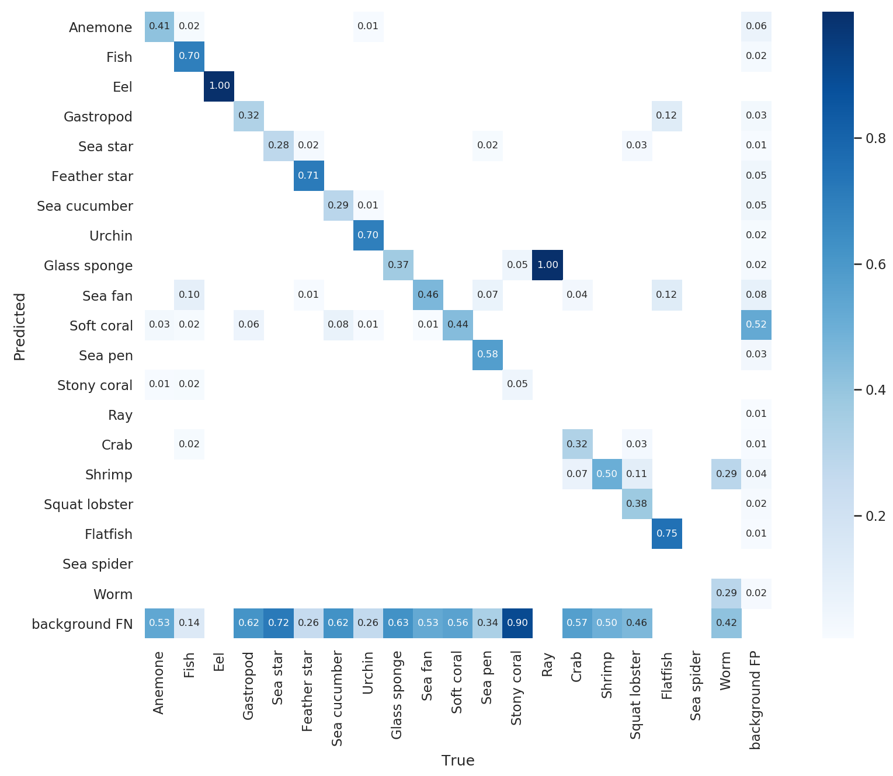
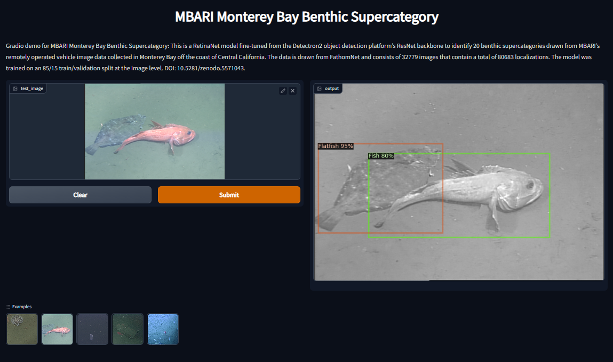

### Description 
This is a RetinaNet model fine-tuned from the Detectron2 object detection platform's ResNet backbone to identify 20 benthic supercategories drawn from MBARI's remotely operated vehicle image data collected in Monterey Bay off the coast of Central California. The data is drawn from FathomNet and consists of 32779 images that contain a total of 80683 localizations. The model was trained on an 85/15 train/validation split at the image level. DOI: 10.5281/zenodo.5571043

#### Repository Status:
- Working [`inference`](inference.py) script and Notebooks ✅
- Working [`Dockerfile`](Dockerfile) (for performing inference) ✅
- `inference` script contains hooks to use with [TATOR](tator.io) ✅
- Working [HuggingSpace demo](https://huggingface.co/spaces/Jordan-Pierce/MBARI_Benthic_Supercategory_Object_Detector) (see below) ✅
  
#### HuggingFace Demo

Click on the image below to be redirected to a `HuggingSpace` that is set 
up to demonstrate the capabilities of this particular model. Feel free to 
include your own test images, or use the examples provided (these were 
selected randomly from [FathomNet](fathomnet.com)).

