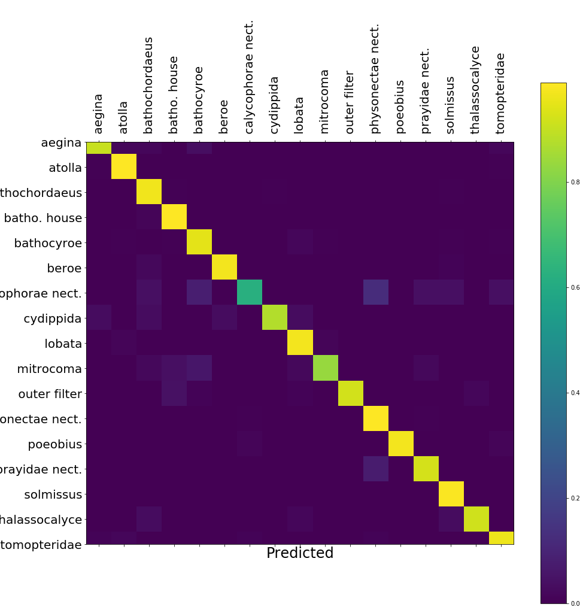
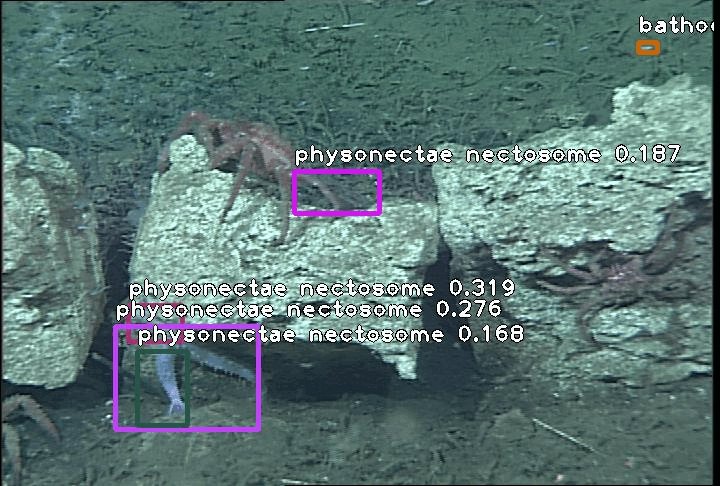

### Description 🤖🎥🐠

A fine-tuned RetinaNet model with a ResNet-50 backbone trained to identify 16 midwater classes. The 29,327 training images were collected in Monterey Bay by a two imaging systems developed at the Monterey Bay Aquarium Research Institute.  The monochrome and 3-channel color images contain a total of 34,071 localizations that were split into 90/10 train/validation sets. The full set of images will be loaded into FathomNet and a list of persistent URLs will be added to a future version of this repository.

For more details about this model and the associated project please see:

Katija, Kakani, Paul LD Roberts, Joost Daniels, Alexandra Lapides, Kevin Barnard, Mike Risi, Ben Y. Ranaan, Benjamin G. Woodward, and Jonathan Takahashi. "[Visual tracking of deepwater animals using machine learning-controlled robotic underwater vehicles.](https://openaccess.thecvf.com/content/WACV2021/papers/Katija_Visual_Tracking_of_Deepwater_Animals_Using_Machine_Learning-Controlled_Robotic_Underwater_WACV_2021_paper.pdf)" In Proceedings of the IEEE/CVF Winter Conference on Applications of Computer Vision, pp. 860-869. 2021.  

### Repository Status:
- Working [`Dockerfile`](Dockerfile) ✅😀
- Working [`inference`](Scripts/inference.py) script ✅😀
- Working [`inference`](Scripts/tator_inference.py) script to use with [TATOR](tator.io) ✅😀
- Working HuggingSpace demo ❌😢

### Example Output (GIF):

