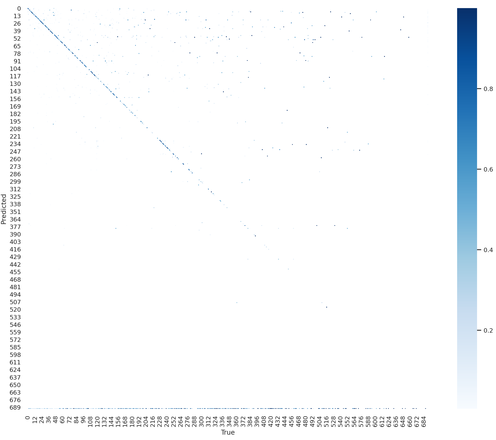
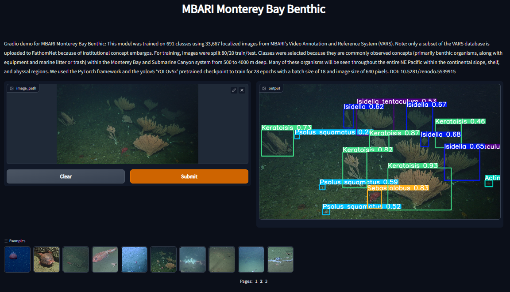

### Description 🤖🎥🐠

This model was trained on 691 classes using 33,667 localized images from MBARI’s Video Annotation and Reference System (VARS). Note: only a subset of the VARS database is uploaded to FathomNet because of institutional concept embargos. For training, images were split 80/20 train/test. Classes were selected because they are commonly observed concepts (primarily benthic organisms, along with equipment and marine litter or trash) within the Monterey Bay and Submarine Canyon system from 500 to 4000 m deep. Many of these organisms will be seen throughout the entire NE Pacific within the continental slope, shelf, and abyssal regions. We used the PyTorch framework and the yolov5 ‘YOLOv5x’ pretrained checkpoint to train for 28 epochs with a batch size of 18 and image size of 640 pixels. DOI: 10.5281/zenodo.5539915

### Repository Status:
- Working [`Dockerfile`](Dockerfile)  ✅😀
- Working [`inference`](Scripts/inference.py) script ✅😀
- Working [`inference`](Scripts/tator_inference.py) script to use with [TATOR](tator.io) ✅😀
- Working [HuggingSpace demo](https://huggingface.co/spaces/Jordan-Pierce/MBARI_Monterey_Bay_Benthic) (see below) ✅😀

  
### HuggingSpace Demo 🤗

Click on the image below to be redirected to a `HuggingSpace` that is set 
up to demonstrate the capabilities of this particular model. Feel free to 
include your own test images, or use the examples provided (these were 
selected randomly from [FathomNet](fathomnet.com)🦑).

