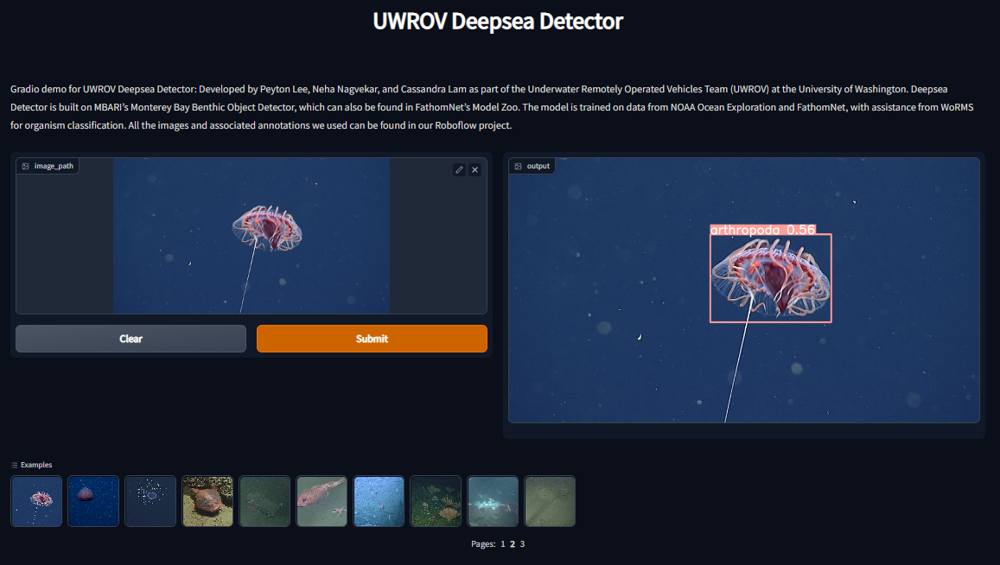

# Deepsea-Detector
<a href="https://uwrov.org" target="_blank" rel="noreferrer noopener">
  
</a>

A deep-sea creature detector for the [2022 MATE Machine Learning Satellite Challenge](https://materovcompetition.org/content/2022-mate-rov-competition-satellite-challenges).

Developed by Peyton Lee, Neha Nagvekar, and Cassandra Lam as part of the Underwater Remotely Operated Vehicles Team (UWROV) at the University of Washington.

#### Repository Status:
- Working [`inference`](inference.py) script and Notebooks ✅
- Working [`Dockerfile`](Dockerfile) (for performing inference) ✅
- `inference` script contains hooks to use with [TATOR](tator.io) ✅
- Working [HuggingSpace demo](https://huggingface.co/spaces/Jordan-Pierce/UWROV_Deepsea_Detector) (see below) ✅

  
#### HuggingFace Demo

Click on the image below to be redirected to a `HuggingSpace` that is set 
up to demonstrate the capabilities of this particular model. Feel free to 
include your own test images, or use the examples provided (these were 
selected randomly from [FathomNet](fathomnet.com)).

[](https://huggingface.co/spaces/Jordan-Pierce/UWROV_Deepsea_Detector)


## Overview
Deepsea-Detector is built on MBARI's [Monterey Bay Benthic Object Detector](https://zenodo.org/record/5539915), which can also be found in FathomNet's [Model Zoo](https://github.com/fathomnet/models). The model is trained on data from [NOAA Ocean Exploration](https://oceanexplorer.noaa.gov/) and [FathomNet](http://fathomnet.org/fathomnet/#/), with assistance from [WoRMS](https://www.marinespecies.org/) for organism classification. All the images and associated annotations we used can be found in our [Roboflow project](https://universe.roboflow.com/uwrov-2022-ml-challenge/deepsea-detect--mate-2022-ml-challenge).

Deepsea-Detector uses [YOLOv5](https://github.com/ultralytics/yolov5/) for detections and [Norfair](https://github.com/tryolabs/norfair/) for tracking.

## Installation
You'll need **Python 3.8 or higher** for this project. We use Git LFS to store some of our larger files, including the weights for our YOLOv5 model.

Open a command terminal and run the following lines:
```
git clone https://github.com/ShrimpCryptid/deepsea-detector.git
cd deepsea-detector
git lfs install; git lfs fetch; git lfs pull
pip install -r requirements.txt
```
This downloads and installs this project and all of its dependencies.

## Running Inference
### Running via Deepsea-Detector UI
Run the following command to boot up the UI:
```
python src/deepsea_detector_ui.py
```

This will boot up the Deepsea-Detector UI! Follow the prompts to set up your output video and output comma separated value (CSV) files.


Deepsea-Detector will output a CSV file that includes the first timestamp/frame an organism appeared, its predicted classification, and the timestamp/frame of its exit from view. It will also output an MP4 video file that shows localizations (and optionally classifications as well).

### Running via Command Line Interface (CLI) or Google Colab
Our UI is a wrapper around the Deepsea-Detector CLI. This allows you to process multiple videos in sequence and define an output directory for videos. To see the full list of options and arguments, run:
```
python src/detection.py --help
```

You can also see an example in our [Google Colab notebook](https://colab.research.google.com/github/ShrimpCryptid/deepsea-detector/blob/main/notebooks/Run%20Video%20Inference.ipynb), which gives you access to GPU resources for free!

## Additional Resources:
Dataset: [Roboflow project](https://universe.roboflow.com/uwrov-2022-ml-challenge/deepsea-detect--mate-2022-ml-challenge)\
Model Training: [Google Colab Python Notebook](https://colab.research.google.com/github/ShrimpCryptid/deepsea-detector/blob/main/notebooks/Model%20Training.ipynb)\
Additional Documentation: [In-depth Project Explanation](https://github.com/ShrimpCryptid/deepsea-detector/blob/main/docs/README.md)

## Acknowledgements:
We would like to thank the following people and organizations:
- [MATE](https://materovcompetition.org/) and [NOAA Ocean Exploration](https://oceanexplorer.noaa.gov/) for hosting this competition,
- The [World Register of Marine Species (WoRMS)](https://www.marinespecies.org/), [FathomNet](http://fathomnet.org/fathomnet/#/), and NOAA Ocean Exploration for providing data,
- our mentor, Rick Rupan,
- and to Professor Joseph Redmon for his guidance and support.

<div>
  <a href="https://www.fathomnet.org" target="_blank" rel="noreferrer noopener">
    
  </a>
  <a href="https://www.marinespecies.org/" target="_blank" rel="noreferrer noopener">
    
  </a>
  <a href="https://oceanexplorer.noaa.gov" target="_blank" rel="noreferrer noopener">
    
  </a>
  <a href="https://materovcompetition.org" target="_blank" rel="noreferrer noopener">
    
  </a>
</div>
